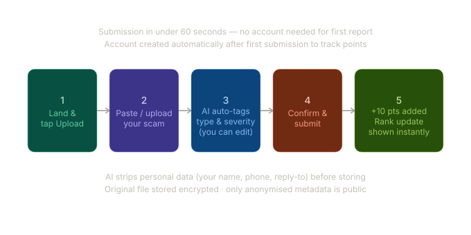
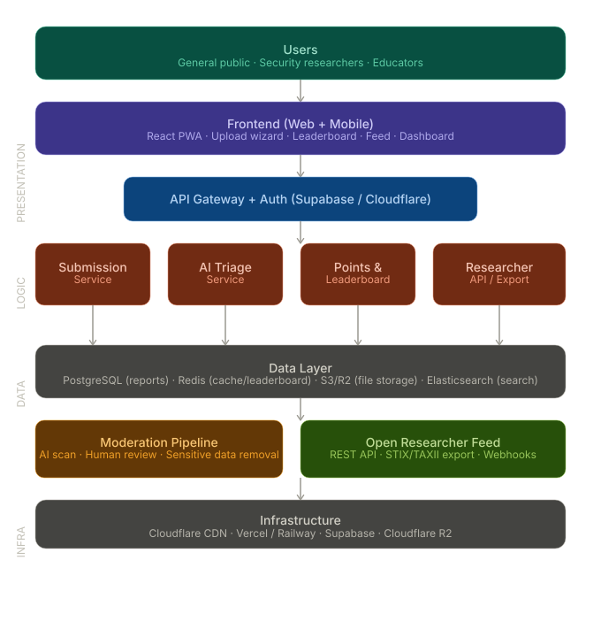

# UbuntuScamBank

> _"I am because we are."_ — A community-powered shield against scams.

**UbuntuScamBank** is a crowdsourced threat intelligence platform built by [The Root Access Network (TRAN)](https://therootaccessnetwork.com) under the [Ubuntu Bridge Initiative (UBI)](https://ubuntubridgeinitiatives.org/). Anyone can report scams they've received, earn points for contributing, and help protect others in their community. Security researchers get access to a clean, open feed of real-world threat data.

**Current release:** v0.9.4 — live at **[https://scambank.ubuntubridgeinitiatives.org/](https://scambank.ubuntubridgeinitiatives.org/)**

---

## 🎯 What It Does

- **Report** — Submit scams you've received (SMS, email, WhatsApp, phone calls, links, screenshots, and more)
- **Earn** — Get points for verified reports that help others stay safe
- **Protect** — Browse and search the community scam feed to recognise threats before they hit you
- **Research** — Security researchers access a structured, open feed of crowdsourced threat intelligence via a REST API

---

## 🔁Submission Flow

Here's how a user submits a scam report in under 60 seconds:



---

## 🛠️ Tech Stack

| Layer           | Technology                                                                                  |
| --------------- | ------------------------------------------------------------------------------------------- |
| Frontend        | [Next.js 16](https://nextjs.org/) + TypeScript (App Router)                                 |
| Styling         | Tailwind CSS v4 — design tokens via `@theme` in `globals.css`                               |
| Backend / API   | Next.js API Routes (same repo)                                                              |
| Database & Auth | [Supabase](https://supabase.com/) (PostgreSQL + Auth + Storage)                             |
| AI Triage       | [Claude API](https://anthropic.com/) — `claude-sonnet-4-6`                                  |
| Email           | [Resend](https://resend.com/) — transactional + digest audience                             |
| Deployment      | [Vercel](https://vercel.com/) (primary) + Cloudflare Workers (legacy, pending decommission) |

Cloudflare Workers deployment at `ubuntu-scam-bank.therootaccessnetwork.workers.dev` remains active during transition. Vercel (`scambank.ubuntubridgeinitiatives.org`) is the canonical production URL.

### System Architecture

Our three-layer architecture ensures scalability, security, and reliability:



---

## 🚀 Getting Started

### Prerequisites

- [Node.js](https://nodejs.org/) v22+ (Wrangler 4.x requires v22; Vercel is fine with v18+)
- [npm](https://www.npmjs.com/)
- A [Supabase](https://supabase.com/) project (free tier works)

### Installation

```bash
git clone https://github.com/TheRootAccessNetwork/ubuntu-scam-bank.git
cd ubuntu-scam-bank
git checkout dev
npm install
cp .env.example .env.local
# Fill in your environment variables
```

### Environment Variables

```env
# Required
NEXT_PUBLIC_SUPABASE_URL=your_supabase_project_url
NEXT_PUBLIC_SUPABASE_ANON_KEY=your_supabase_anon_key
SUPABASE_SERVICE_ROLE_KEY=your_supabase_service_role_key
ANTHROPIC_API_KEY=your_anthropic_api_key

# Optional — email features skip silently if absent
RESEND_API_KEY=your_resend_api_key
RESEND_AUDIENCE_ID=your_resend_audience_id

# Required for Vercel deployments
NEXT_PUBLIC_APP_URL=https://scambank.ubuntubridgeinitiatives.org
```

**Vercel env var placement:** Non-public secrets (`SUPABASE_SERVICE_ROLE_KEY`, `ANTHROPIC_API_KEY`, `RESEND_API_KEY`) must be set in the Vercel dashboard under Settings → Environment Variables for the Production environment.

### Running Locally

```bash
npm run dev
```

Open [http://localhost:3000](http://localhost:3000).

### Cloudflare Workers preview (legacy)

```bash
npm run preview
```

Open [http://localhost:8787](http://localhost:8787). Use this only when testing Cloudflare-specific behaviour. Vercel is the primary deployment target.

---

## 📁 Project Structure

```bash
ubuntu-scam-bank/

├── src/

│   ├── app/

│   │   ├── (public)/              # Public-facing pages

│   │   │   ├── page.tsx           # Homepage

│   │   │   ├── reports/           # /reports — paginated feed

│   │   │   ├── reports/[id]/      # Report detail page

│   │   │   ├── leaderboard/       # Leaderboard with global/monthly/country tabs

│   │   │   ├── profile/           # User profile (auth required)

│   │   │   ├── researchers/apply/ # Researcher API application

│   │   │   └── feedback/          # Contact form

│   │   ├── ops/                   # Protected admin panel (/ops)

│   │   │   ├── page.tsx           # Overview

│   │   │   ├── users/             # User management

│   │   │   ├── applications/      # Researcher applications

│   │   │   ├── reports/           # Moderation queue

│   │   │   └── digest/            # Email digest preview

│   │   ├── api/

│   │   │   ├── submit/            # POST /api/submit

│   │   │   ├── feedback/          # POST /api/feedback

│   │   │   ├── digest/preview/    # GET /api/digest/preview (mod only)

│   │   │   ├── ops/               # POST /api/ops/* (mod only)

│   │   │   └── v1/reports/        # GET /api/v1/reports (researcher API)

│   │   ├── auth/callback/         # OAuth callback

│   │   ├── layout.tsx             # Root layout

│   │   └── globals.css            # Tailwind v4 design tokens

│   ├── components/

│   │   ├── layout/                # Nav, Footer, Sidebar, Container

│   │   ├── forms/                 # SubmissionForm

│   │   ├── feed/                  # FeedList, FeedSection

│   │   ├── reports/               # VoteButtons, OriginalSubmission, ReportFilters

│   │   ├── leaderboard/           # CountrySelect, MonthSelect

│   │   ├── home/                  # FAQ

│   │   ├── profile/               # ProfileForm

│   │   ├── researchers/           # ApplicationForm

│   │   ├── auth/                  # AuthModal

│   │   └── ops/                   # UserSearch, UserActions, ApplicationActions, ReportActions

│   ├── lib/

│   │   ├── supabase/              # client.ts, server.ts, middleware.ts

│   │   ├── ai/                    # triage.ts, prompts.ts

│   │   ├── points/                # calculate.ts

│   │   ├── storage/               # upload.ts

│   │   ├── email/                 # send.ts, templates.ts, audience.ts

│   │   ├── ops/                   # requireModerator.ts

│   │   ├── api/                   # validateApiKey.ts

│   │   └── utils.ts

│   └── types/

│       ├── database.ts            # Generated Supabase types

│       └── triage.ts              # TriageResult re-exports

├── public/

│   └── favicon.svg                # Custom shield-check SVG favicon

├── middleware.ts                  # Session refresh + /ops route guard

├── vercel.json                    # Vercel deployment config

├── wrangler.jsonc                 # Cloudflare Workers config (legacy)

├── open-next.config.ts            # OpenNext adapter config (legacy)

└── package.json
```

---

## Design Tokens

| You need                         | Tailwind class                 |
| -------------------------------- | ------------------------------ |
| Brand green background           | `bg-brand`                     |
| Dark green text (on light badge) | `text-brand-dark`              |
| Light green card background      | `bg-brand-light`               |
| Phishing badge                   | `bg-phishing-bg text-phishing` |
| Severity high dot                | `bg-severity-high`             |
| White card surface               | `bg-canvas`                    |
| Off-white page background        | `bg-canvas-subtle`             |
| Primary body text                | `text-fg`                      |
| Muted/secondary text             | `text-fg-muted`                |
| Subtle border                    | `border-stroke-faint`          |
| Card shadow                      | `shadow-card`                  |
| Card border radius               | `rounded-lg`                   |
| Input border radius              | `rounded-md`                   |
| Sans font                        | `font-sans`                    |
| Mono font (IOCs, API code)       | `font-mono`                    |

All tokens defined in `src/app/globals.css` via `@theme`. No `tailwind.config.ts` — Tailwind v4 config-free.

---

## 🗺️ What's Shipped (v0.9.4)

- ✅ Scam submission with AI triage (text + image via Claude vision API)
- ✅ Public feed — homepage preview + `/reports` paginated page
- ✅ Report detail pages — IOCs, tags, voting, original submission toggle
- ✅ User authentication (Google OAuth + email/password)
- ✅ Points system with badge tiers (Watcher → Guardian → Sentinel → Elite Sentinel → Sage)
- ✅ Leaderboard — global, monthly with month picker, full-world country filter
- ✅ User profiles — display name, bio, country
- ✅ Researcher API (`GET /api/v1/reports`, `GET /api/v1/reports/:id`)
- ✅ Researcher application → ops approval → Resend key delivery
- ✅ Ops admin panel — user management, application review, moderation queue, digest preview
- ✅ Email digest audience sync via Resend
- ✅ `raw_content` excluded from public API surface (`public_reports` view)
- ✅ Custom SVG favicon, FAQ accordion, contact form

## What's Next

- Rate limiting enforcement on `/api/v1/`
- STIX 2.1 export for Elite Sentinel tier
- Campaign clustering (grouping related reports)
- Streak bonus code paths
- Email digest automation via Vercel Cron

---

## 🤝 Contributing

This is an internal TRAN project. See [BRANCHING_STRATEGY.md](BRANCHING_STRATEGY.md) for the workflow. In short: branch off `dev` → PR back to `dev` → maintainers handle `dev → main` releases.

Direct pushes to `main` or `dev` are not permitted.

---

## 🔒 Security

Report vulnerabilities responsibly by emailing **[info@therootaccessnetwork.com](mailto:therootaccessnetwork@africybercore.com)** rather than opening a public issue.

---

## 📄 License

[MIT License](LICENSE) — © 2026 [The Root Access Network](https://therootaccessnetwork.com)

---

## 🌍 About TRAN

The Root Access Network is a Lagos-based cybersecurity education company dedicated to making digital safety accessible to everyone — from secondary school students to early-career professionals across Africa and beyond.

🌐 [therootaccessnetwork.com](https://therootaccessnetwork.com) · 📧 [info@therootaccessnetwork.com](mailto:therootaccessnetwork@africybercore.com)
